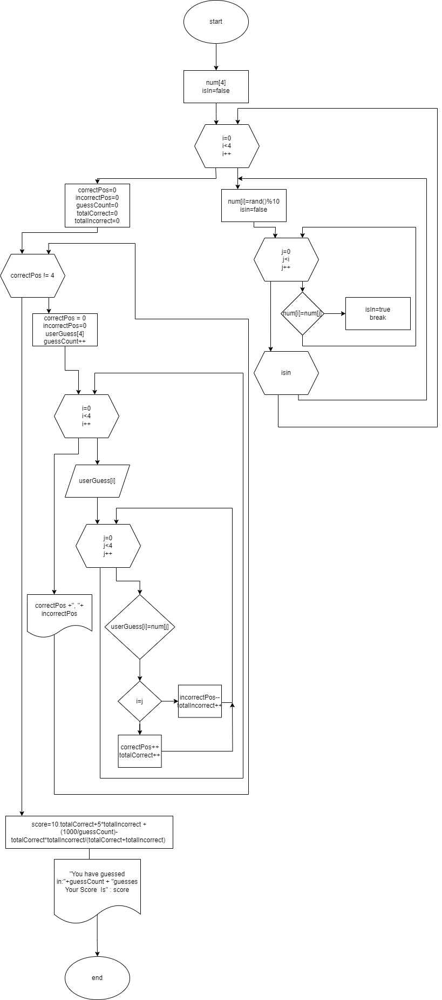

# GuessTheNumber!
In this game the player tries to guess a randomly generated 4 digit number in less then 10 guesses.  
Each digit can be between [0-9] (inclusive) and each is different then the others. 
Game gives clues to player about their guess each time.
It tells player 2 integers about their guess. first one is  0 or a pozitive second one is 0 or a negative number.
pozitive one tells player how many numbers are in the correct pozition in their guess.
second one tells the player that they have some correct numbers in their guess but they are in the wrong place.
the sum of absolute values of these give how many numbers they have got in total  
EXAMPLE:
random number: 1234
Guess 1: 7248
Response 1: +1,-1
Guess 2: 1324
Response: +2,-2
Guess 3 :1234
Response: You Won!

